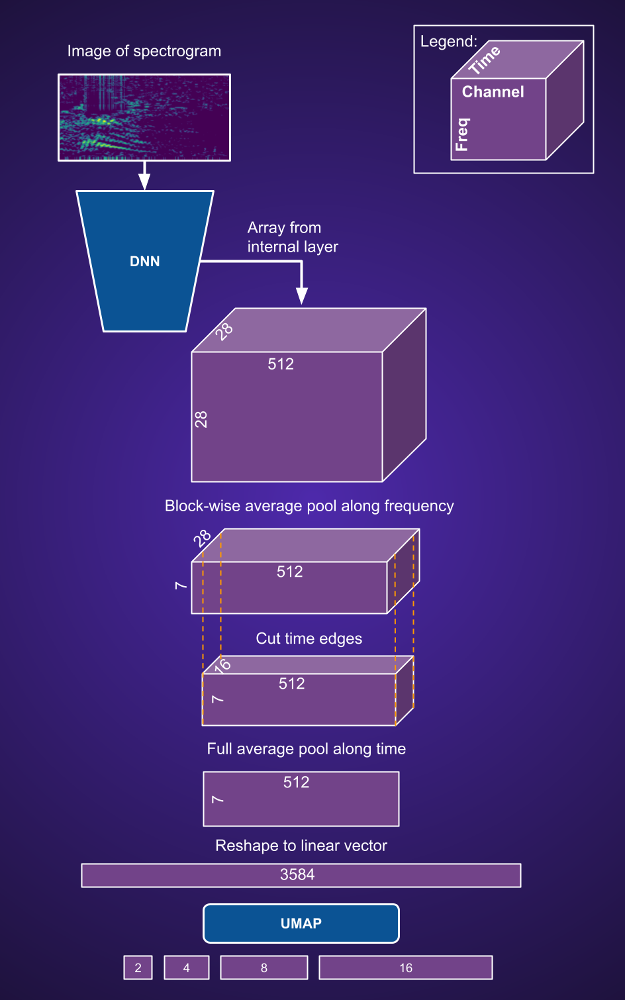

# Feature extraction from spectrograms with pre-trained image DNNs (fe_idnn)

### Overview
* Primarily developed for acoustic recordings from [xeno-canto](https://xeno-canto.org/)
* Download of mp3 and conversion to spectrograms as RGB images can be performed with [this tool](https://github.com/sergezaugg/xeno_canto_organizer)  
* Images can then be processed with the **FeatureExtractor** class provided here
* First, extract array features from inner layers of pre-trained image DNNs and transform to long linear features
* Second, dim reduce the linear features with UMAP to shorter feature vectors
* Full and reduced-dim features as stored as NPZ files

### Usage
* Main functionality called via a single class **FeatureExtractor**
* Illustration with short interactive script [sample_code.py](sample_code.py)

### Companion project
* NPZ files can then stored on a Kaggle dataset [(example)](https://www.kaggle.com/datasets/sezaugg/spectrogram-clustering-01) where the [frontend](https://spectrogram-image-clustering.streamlit.app/) will fetch them [(Github repo)](https://github.com/sergezaugg/spectrogram_image_clustering)  

### Intallation (usage in Python project)
* Make a fresh venv an install fe_idnn from Python package wheel found on [this github repo](https://github.com/sergezaugg/feature_extraction_idnn/releases)
* ```pip install https://github.com/sergezaugg/feature_extraction_idnn/releases/download/vx.x.x/fe_idnn-x.x.x-py3-none-any.whl```
* **torch** and **torchvision** must be installed separately for specific CUDA version
* ```pip install torch torchvision --index-url https://download.pytorch.org/whl/cu126``` (e.g. for Windows with CUDA 12.6 and Python 3.12.8)
* If other CUDA version needed, check instructions here https://pytorch.org/get-started/locally

### Intallation (usage in Kaggle notebook)
* On Kaggle packages are already installed, for notebooks try this:
* ```!pip install --no-deps https://github.com/sergezaugg/feature_extraction_idnn/releases/download/vx.x.x/fe_idnn-x.x.x-py3-none-any.whl```

### Intallation (development)
* Clone the repo and navigate to its root dir
* ```pip install -r requirements.txt```
* ```pip install torch torchvision --index-url https://download.pytorch.org/whl/cu126``` (for Windows with CUDA 12.6 and Python 3.12.8)
* If other CUDA version, check instructions here https://pytorch.org/get-started/locally

### Project Structure
```
├── dev_data/           # A few images for dev and sample code
├── dev_scripts/        # Development scripts
├── pics/               # Images for documentation
├── src/                # Source code (Python package)
├── pyproject.toml      # Build configuration
├── README.md           # Project documentation
├── requirements.txt    # Python dependencies
└── sample_code.py      # Example usage script
```

### ML details


---

